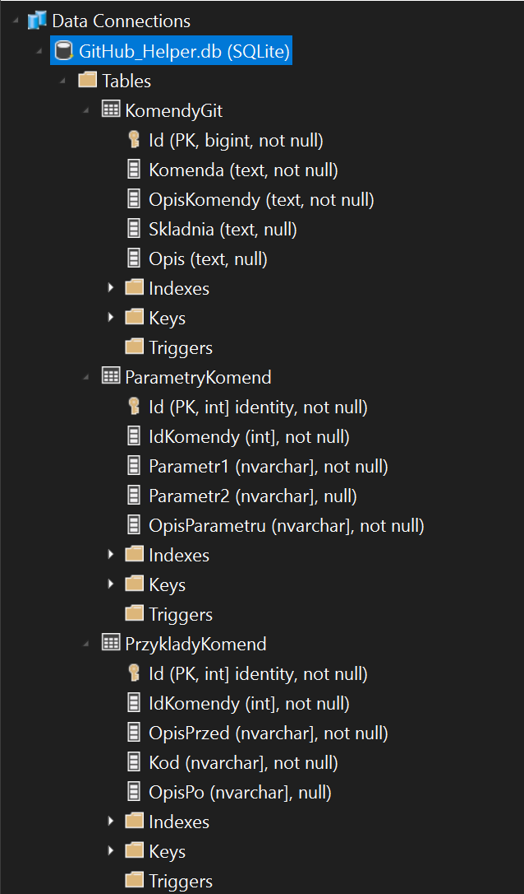

## Struktura Bazy Danych

Aplikacja GitHub Helper korzysta z bazy danych SQLite o nazwie `GitHub_Helper.db`, która zawiera trzy tabele: `KomendyGit`, `ParametryKomend`, oraz `PrzykladyKomend`. Poniżej znajduje się szczegółowy opis każdej z tabel i ich pól.

### Tabela `KomendyGit`

Przechowuje informacje o komendach Git.

| Kolumna       | Typ          | Opis                         |
| ------------- | ------------ | ---------------------------- |
| `Id`          | bigint (PK)  | Identyfikator komendy        |
| `Komenda`     | text         | Nazwa komendy                |
| `OpisKomendy` | text         | Opis komendy                 |
| `Skladnia`    | text         | Składnia komendy             |
| `Opis`        | text         | Dodatkowy opis komendy       |

### Tabela `ParametryKomend`

Przechowuje informacje o parametrach dla każdej komendy Git.

| Kolumna         | Typ         | Opis                            |
| --------------- | ----------- | ------------------------------- |
| `Id`            | int (PK)    | Identyfikator parametru         |
| `IdKomendy`     | int         | Identyfikator komendy (FK)      |
| `Parametr1`     | nvarchar    | Nazwa pierwszego parametru      |
| `Parametr2`     | nvarchar    | Nazwa drugiego parametru (opcjonalne) |
| `OpisParametru` | nvarchar    | Opis parametru                  |

### Tabela `PrzykladyKomend`

Przechowuje przykłady użycia komend Git.

| Kolumna     | Typ         | Opis                             |
| ----------- | ----------- | -------------------------------- |
| `Id`        | int (PK)    | Identyfikator przykładu          |
| `IdKomendy` | int         | Identyfikator komendy (FK)       |
| `OpisPrzed` | nvarchar    | Opis przed przykładem            |
| `Kod`       | nvarchar    | Kod przykładu                    |
| `OpisPo`    | nvarchar    | Opis po przykładzie (opcjonalne) |

### Zrzut ekranu struktury bazy danych

